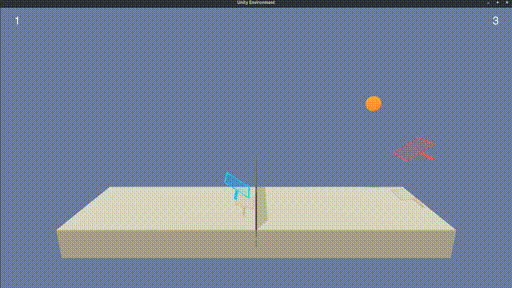

# Deep Reinforcement Learning - Collaboration and Competition Project

In this notebook, we have implemented the [Multi-Agent Deep Deterministic Policy Gradient (MADDPG)](https://arxiv.org/abs/1706.02275) reinforcement learning algorithm for the "Collaboration and Competition" project of the [Udacity Deep Reinforcement Learning Nanodegree program](https://www.udacity.com/course/deep-reinforcement-learning-nanodegree--nd893).

By Sebastian Castro, 2020

---

## Project Introduction

This project uses a version of the [Tennis](https://github.com/Unity-Technologies/ml-agents/blob/master/docs/Learning-Environment-Examples.md#Tennis) environment in Unity ML-Agents.

This environment consists of two tennis players, or agents, each of which has its own local set of observations, actions, and rewards. The specifics are discussed below, but the environment is structured such that a "good" game consists of an infinite volley where both players are constantly hitting the ball back to each other without scoring.

The reinforcement learning specifics for each agent are:

* **State:** `24` variables (`8` observations stacked for `3` subsequent time steps) corresponding to position and velocity of the ball and racket.
* **Actions:** A vector with `2` elements -- one for moving towards/away from the net and another for jumping. Both are continuous variables between `-1.0` and `1.0`.
* **Reward:** The agent receives `+0.1` reward each time it hits the ball over the net, and `-0.01` if it lets a ball hit the ground or go out of bounds. This is what incentivizes the agents to play forever rather than scoring, unlike your typical game of tennis.

As per the project specification, both agents are considered to have "solved" the problem if the maximum return of the 2 agents is greater than `0.5` over a sustained 100-episode average.

To see more details about the MADDPG agent implementation, network and training hyper parameters, and results, refer to the [Report](Report.md) included in this repository.

---

## Getting Started

To get started with this project, first you should perform the setup steps in the [Udacity Deep Reinforcement Learning Nanodegree Program GitHub repository](https://github.com/udacity/deep-reinforcement-learning). Namely, you should

1. Install [Conda](https://docs.conda.io/en/latest/) and create a Python 3.6 virtual environment
2. Install [OpenAI Gym](https://github.com/openai/gym)
3. Clone the [Udacity repo]((https://github.com/udacity/deep-reinforcement-learning)) and install the Python requirements included
4. Download the Tennis Unity files appropriate for your operating system and architecture ([Linux](https://s3-us-west-1.amazonaws.com/udacity-drlnd/P3/Tennis/Tennis_Linux.zip), [Mac OSX](https://s3-us-west-1.amazonaws.com/udacity-drlnd/P3/Tennis/Tennis.app.zip), [Win32](https://s3-us-west-1.amazonaws.com/udacity-drlnd/P3/Tennis/Tennis_Windows_x86.zip), [Win64](https://s3-us-west-1.amazonaws.com/udacity-drlnd/P3/Tennis/Tennis_Windows_x86_64.zip))

Once you have performed this setup, you should be ready to run the [`tennis_maddpg.ipynb`](tennis_maddpg.ipynb) Jupyter Notebook in this repo. This notebook contains all the steps needed to define and train MADDPG agents to solve this environment.