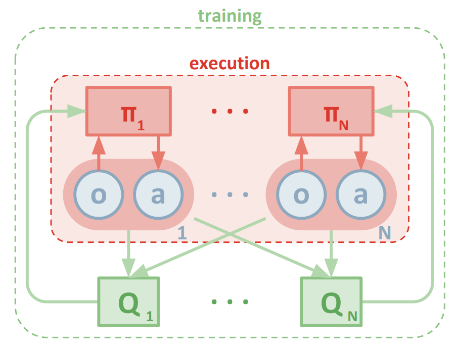
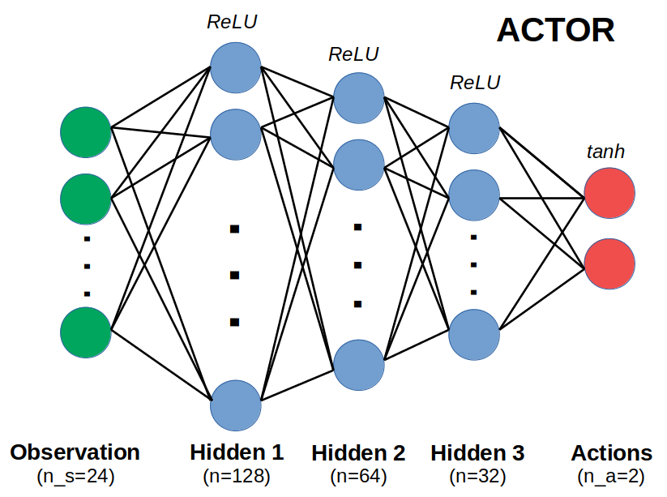
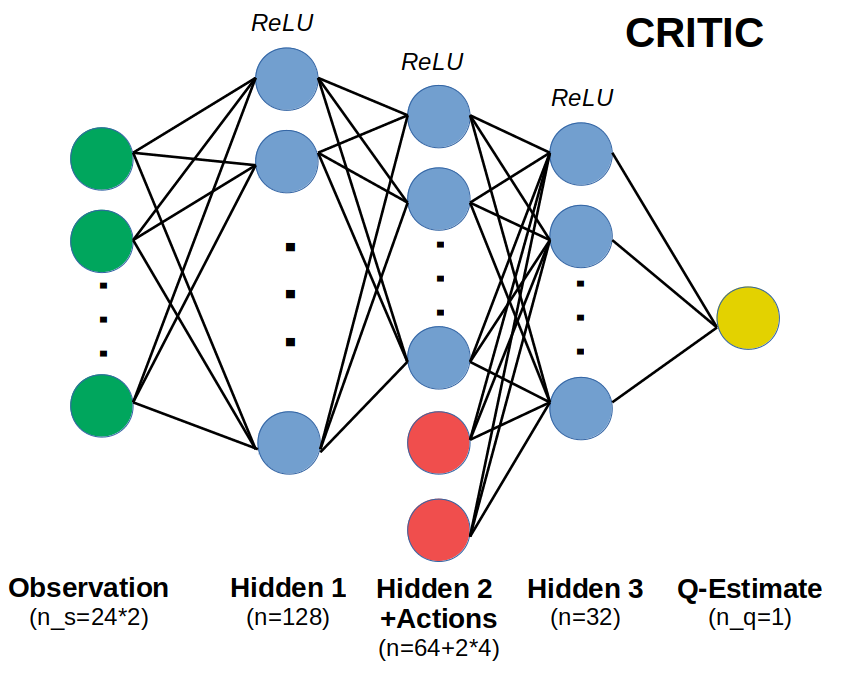
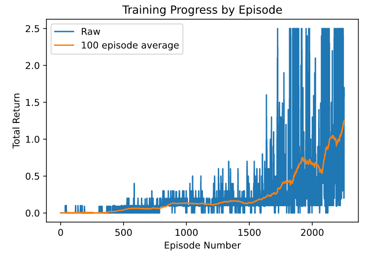
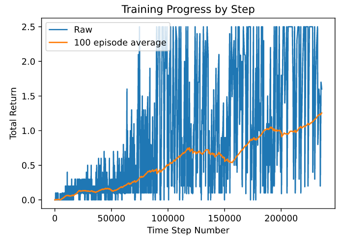
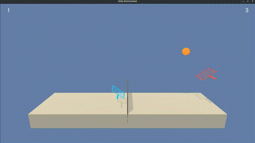

# Continuous Control Project - Technical Report

By Sebastian Castro, 2020

---

## Learning Algorithm

### Approach

For this project, we implemented the [Multi-Agent Deep Deterministic Policy Gradient (MADDPG)](https://arxiv.org/abs/1706.02275) reinforcement learning algorithm.

This was selected because it is an actor-critic reinforcement learning algorithm that can handle a continuous action space and leverages the collection of experiences from multiple identical agents into a combined experience buffer. DDPG is an off-policy algorithm, which is why we use an experience buffer that can sample from past experiences to continue training the agents with a dataset that grows over time.

The difference between regular DDPG and MADDPG is that, while each agent has a decentralized actor (i.e., local observations and actions), the critic is decentralized. This means that the critic of each agent can provide an estimate of the Q-Function provided the observations and actions from all agents. This provides the advantage of learning using as much information as possible, but still being able to deploy policies (which only requires the actor networks) locally on a per-agent basis.

Source: [Lowe, Wu, et al. (2017)](https://arxiv.org/pdf/1706.02275.pdf)

While DDPG is less stable than other policy gradient algorithms such as [Trust Region Policy Optimization (TRPO)](https://arxiv.org/abs/1502.05477) and [Proximal Policy Optimization (PPO)](https://openai.com/blog/openai-baselines-ppo/), there are ways to help stabilize DDPG by keeping track of a separate target networks that is updated more slowly and less frequently than the "online" networks.

For more information on multi-agent deep reinforcement learn, you can refer to [this great blog post from Berkeley Artificial Intelligence Research (BAIR)](https://bair.berkeley.edu/blog/2018/12/12/rllib/).

---

### Neural Network Architecture

Recall that DDPG uses neural networks for both actor and critic. In both cases, we have selected fully-connected networks with 3 hidden layers of decreasing width, from 128 to 32.

Each hidden layer uses a rectified linear unit (ReLU) activation function to encode nonlinearity in the network. 

* The final layer of the actor uses a hyperbolic tangent (tanh) activation function since the output action needs to be constrained between `-1` and `1`.
* The critic network begins with the decentralized set of observations at the first layer and concatenates the actions at the third layer.

---

### Hyperparameters

The hyperparameters used for training our agent using MADDPG are as follows.

#### Reinforcement Learning Parameters
The discount factor `GAMMA` is set to `0.99`, which is a fairly standard value for RL problems.

The soft-update weight `TAU` for updating target networks is set to `2e-3`. Recall that this is the fraction (between 0 and 1) of how much to copy over weights from the latest trained networks vs. retaining previous weights from the target networks.

#### Termination Criteria
With this environment, it's a bit tricky running for a certain number of episodes since episodes get longer and longer as training goes on. For this reason, we chose to train until a certain score was reached and we also terminate episodes after a certain number of steps to prevent very long games.

Recall that we consider this game to be "solved" when the running 100-episode average of the maximum return (over both agents) is 0.5.

* Training is completed when the max average return reaches `1.25`
* An individual episode is terminated early if its max average return reaches `2.5`.

#### Training Hyperparameters
* Every `5` steps of the environment, we perform `10` updates using minibatches of `128` sampled from an experience buffer that can hold up to `500000` experiences.
* The actor has a learning rate of `2e-4` and L2 regularization weight of `1e-6`.
* The critic has a learning rate of `1e-3` and L2 regularization of `1e-5`. Note that its learning rate is higher since it's better to have a good estimate of a state-action value before training a policy, and it has higher weight decay to prevent the typical "over-optimism" of DDPG critics.
* The gradient for both actor and critic networks is clipped to a maximum value of `1.0` to prevent instability.

#### Noise Parameters
As with most DDPG implementations, exploration is embedded into training using [Ornstein-Uhlenbeck process noise](https://en.wikipedia.org/wiki/Ornstein%E2%80%93Uhlenbeck_process).

The initial scale of the noise is `0.5`, but it decays with a multiplicative factor of `(1-2.5e-5)` every time step up until a minimum scale of `0.05`. This way exploration reduces (but is not completely gone) later on in training.

---

## Results

As per the project specification, an agent is considered to have "solved" the problem if the maximum return over both agents, averaged over a 100-episode window, exceeds `0.5` .

In our implementation, training is stopped with an average maximum return of `1.25`, and that is considering that we terminate some episodes early at a value of `2.5` to speed up training. Below are the results ploted both over episode number and time step number, noting that the time axis gets "stretched" over time due to longer episodes later on in training.

The GIF below shows a snippet of our final trained agents running. You can also find the final weights of both actors in the `best_weights_0.pth` and `best_weights_1` files.

---

## Future Work

In the [MADDPG paper](https://arxiv.org/abs/1706.02275), sections 4.2 and 4.3 discuss some potential improvements -- namely for each agent to keep its own estimate of other agents' policies (thus removing the centralized training requirement), and using ensembles of policies to improve results at the expense of resource usage both at training time and runtime. Moving to a fully decentralized multi-agent training regime is of particular interest in environments that have more than 2 agents, since this would otherwise cause exponential growth in the input (and thus parameter) space of each critic.

As this was a relatively simple environment, we did not explore any parallel computing to try collect data and train faster. Algorithms like [Distributed Distributional Deep Deterministic Policy Gradient (D4PG)](https://arxiv.org/pdf/1804.08617.pdf) could be good to investigate for future work, especially on larger environments that demand more computing and perhaps decentralized training for each agent.

Finally, we return to the argument that DDPG is a notoriously unstable algorithm. Perhaps using other deep RL algorithms that handle continuous action spaces, such as TRPO or PPO, could improve training stability and overall results even if they are not doing any mixing of observations and actions in centralized multi-agent critics like we have seen here with DDPG. We have discussed some of the disadvantages of decentralization, such as no longer having a shared experience buffer for data efficienty. However, TRPO/PPO do not use an experience buffer so this would not be missed in a decentralized setting.

